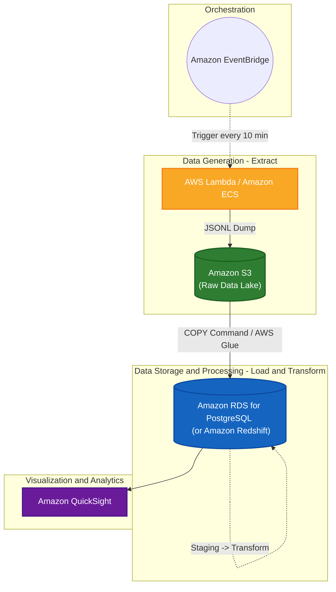

# 데이터 웨어하우스(DW) 기반 이벤트 로깅 ELT 파이프라인

이 프로젝트는 무작위 가상 사용자를 생성하고 그들의 행동 이벤트를 추적하여 최적의 분석 상태로 정제하는 소규모 데이터 웨어하우스(Data Warehouse) 파이프라인입니다. 

단순히 로그를 데이터베이스에 밀어 넣는 방식에서 진일보하여, 원본 데이터를 확보(Extract)한 뒤 Staging 테이블로 로딩(Load)하고, 최종적으로 분석 목적에 맞게 테이블 구조를 변환(Transform)하는 전형적인 **ELT 아키텍처**를 채택했습니다. 이 모든 과정은 Docker Compose를 통해 단일 명령어로 즉시 실행됩니다.

## 주요 특징 (Key Features)

1. **ELT 프레임워크 기반 설계**: 원본 데이터(Raw Data) 유실을 막기 위한 로컬 덤프 파일부터 분석 최적화 형태인 마트(Marts) 레이어까지 체계적인 데이터 흐름을 보여줍니다.
2. **SCD Type 2 차원(Dimension) 모델링**: 회원의 멤버십 등급(Free/Premium 등) 상태가 변경되더라도 덮어쓰지 않고, 과거 시점의 정확한 상태 이력을 기록합니다.
3. **정합성을 갖춘 사실(Fact) 테이블**: 이벤트 트래픽이 발생한 시점에 속해있던 회원의 정확한 상태(`dim_user`의 기간 설정과 비교)를 매칭하여 Fact 테이블을 적재합니다.

## 필수 조건
- Docker Engine & Docker Compose

## 시작하기
전체 스택(Python App + PostgreSQL)을 실행하려면 단순히 아래 명령어를 실행하세요:

```bash
docker compose up --build
```

### 실행 시나리오 흐름
1. `event-db`, `event-app` 컨테이너가 시작됩니다.
2. 애플리케이션은 즉시 **과거 5일 치 시뮬레이션 데이터**를 단숨에 생성하고 ELT 변환 작업을 진행합니다.
3. 시뮬레이션 처리가 종료되면 결과물 대시보드 이미지가 출력 폴더에 저장됩니다. (확인 경로: `./output/dashboard.png`)
4. 이후 애플리케이션은 매 10분 간격으로 대기하며, 신규 배치가 발생할 때마다 다시 ELT 파이프라인 루프를 갱신합니다.

---

## 파이프라인 단계별 아키텍처 이해

이 프로젝트의 데이터 흐름은 크게 3가지 레이어로 나뉩니다:

### 1. Raw 레이어 (로컬 JSONL 덤프)
이벤트를 생성하는 `Mock Generator`는 파이썬 딕셔너리로 데이터를 짜낸 다음, 즉시 DB로 쏘지 않고 호스트 로컬 컴퓨터 저장소에 JSONL 형식으로 먼저 씁니다.
- `data/raw/users_{YYYYMMDDHHMMSS}.jsonl`: 사용자 상태 업데이트 내역
- `data/raw/events_{YYYYMMDDHHMMSS}.jsonl`: 트래픽 이벤트 행동 내역

*(Docker 볼륨을 통해 로컬의 `./data/raw` 경로에서도 직접 백업된 원시 파일들을 확인할 수 있습니다.)*

### 2. Staging 레이어 (PostgreSQL Load)
Raw 파일들이 생성되면, 파이썬 스크립트가 로컬 파일을 스캔하여 데이터베이스의 준비 테이블(Staging Table)에 통렬하게 로드(Load)합니다.
- `stg_users_raw`
- `stg_events_raw`

### 3. Marts 레이어 (Transform)
Staging 테이블에 적재된 원시 데이터를 활용하여 DW 분석 목적용 테이블(Dim/Fact)로 가공(Join & Merge)합니다.

#### 차원 테이블 (Dimension): `dim_user`
사용자의 가입 및 변경 정보를 모두 관리합니다.
- **SCD(Slowly Changing Dimension) Type 2 적용**: `valid_from`, `valid_to`, `is_current` 모델링.

#### 사실 테이블 (Fact Table): `fact_events`
- 이벤트 로그 데이터를 Insert 하되, **데이터 발생 당시 시점(`created_at`)을 기준으로 그 당시의 회원 상태값 참조 인덱스(`user_sk`)를 조인**하여 매핑시킵니다.

## 분석 및 시각화 (Visualization)
완성된 Fact-Dimension 모델을 활용해 복잡한 분석 쿼리를 날리고 그래프 대시보드를 갱신합니다:
1. **User Plan별 총 수익 (Revenue by Plan)**
2. **이벤트 트래픽 타입 분석 (Distribution)**

---

## AWS 아키텍처 설계 (AWS Migration Plan)

이 과제의 로컬 ELT 파이프라인(이벤트 생성 → 저장 → 가공 → 시각화)을 실제 대규모 운영이 가능한 AWS 클라우드 아키텍처로 이관한다면 다음과 같은 구성으로 설계할 수 있습니다.

### 구성도 (Architecture Diagram)



### 사용할 AWS 서비스 및 선택 이유

1. **Amazon EventBridge**: 로컬 파이프라인의 `while True / time.sleep(600)` 역할을 담당. 10분마다 이벤트 생성 트리거를 정확하고 안정적으로 호출하기 위해 사용합니다.
2. **Amazon ECS (AWS Fargate) 또는 AWS Lambda**: 파이썬 `main.py`의 데이터 생성(Mocking) 및 가공 스크립트를 실행하는 컴퓨팅 서비스. 배치 작업이 길어지면 Fargate, 짧다면 Lambda를 선택하여 서버를 직접 관리할 필요 없이(Serverless) 코드를 구동합니다.
3. **Amazon S3**: 로컬의 `/data/raw` 폴더를 대체하는 무제한 파일 저장소(Data Lake). JSONL 형식의 원시 로그를 영구적으로, 가장 저렴한 비용으로 보존할 수 있기 때문에 선택합니다.
4. **Amazon RDS for PostgreSQL (또는 Redshift)**: 현재의 `event-db` (PostgreSQL) 컨테이너의 역할. 데이터가 기가바이트 급이라면 RDS로 충분하며, 테라바이트 이상의 대형 데이터 웨어하우징(Marts) 연산이 들어가면 Redshift를 도입하여 성능을 극대화할 수 있습니다.
5. **Amazon QuickSight**: 로컬 파이썬이 `dashboard.png`로 저장하던 시각화 단계를 완전히 대체합니다. 쿼리 결과를 자동으로 연동받아 비즈니스 대시보드로 실시간 시각화해 상시 모니터링 체계를 갖춥니다.

### AWS 서비스의 역할 차이 (나만의 언어로 설명)

* **Amazon S3 (거대한 무한 창고)**: 
  S3는 데이터의 형태나 구조를 따지지 않고 "있는 그대로" 던져놓을 수 있는 아주 싸고 넓은 창고입니다. 파이프라인의 극초반부에서 날 것(Raw)의 이벤트를 잃어버리지 않게 비닐봉지(JSONL)에 싸서 적재해두는 역할을 합니다. 언제든 다시 꺼내 쓸 수 있는 가장 원천적인 보험 데이터 기지입니다.
* **Amazon RDS / Redshift (정교하게 칸막이가 쳐진 서랍장)**: 
  S3가 막무가내 창고라면, DBMS 환경은 분석을 위해 데이터들의 각을 딱딱 맞추어 끼워 넣는 정교한 서랍장입니다. S3에 쌓인 JSONL 파일들을 꺼내 분해한 뒤, 각자 알맞은 칸(`stg_users`, `dim_user`, `fact_events`)에 정리하여 향후 "조회"와 "계산"이라는 행위가 순식간에 이루어지도록 돕는 역할을 합니다.
* **Amazon ECS / QuickSight (지게차 로봇과 뷰티풀 도화지)**:
  ECS는 창고와 서랍장을 오가며 짐을 나르고 조립하는 똑똑한 지게차 로봇(컴퓨팅) 역할을 하며, QuickSight는 서랍장에서 엑셀 표 같은 데이터를 꺼내 대표님이 보기 편한 럭셔리한 그림 한 장으로 뚝딱 그려 보여주는 브리핑 도화지 역할을 합니다.

### 설계한 아키텍처에서 가장 고민한 부분

**"데이터의 구조가 빈번하게 바뀌더라도 유실 없이, 확장 가능한 파이프라인을 구축할 수 있을까?"** 

가장 고민했던 점은 이벤트를 즉시 DB(RDS/Redshift)에 곧바로 `INSERT` 할지, 아니면 **반드시 S3를 거쳐야(S3 Dump → DB Load 단계 분리)** 할지에 대한 판단이었습니다.

결과적으로 이벤트 발생 즉시 DB로 쏘아버리는 파이프라인보다 S3를 중간 레이어로 끼워 넣는 진정한 **ELT(Extract-Load-Transform)** 구조를 설계했습니다. 
그 이유는 이벤트 종류(`event_type`)나 속성이 갑자기 추가/변경될 때, DB 스키마에 즉각 부딪히면 파이프라인 전체가 다운되는 장애(Error)가 발생하기 때문입니다. S3에 원시 JSONL 데이터를 덤프해두는 창고를 거치게 설계함으로써, 추후 DB 단에서 에러가 터지더라도 원본 데이터를 S3에서 다시 되살려 언제든 재처리(Backfill)가 가능하다는 안정성과 확장성을 확보한 점이 이 아키텍처의 핵심이자 가장 오랜 시간 고민한 포인트입니다.
